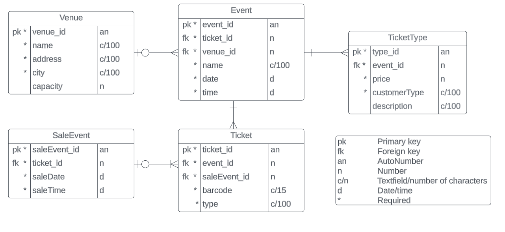

# TicketGuru

Tiimi: KKVVR Solutions eli Salla Komppa, Katariina Kuismin, Perttu Virkki, Joona Virolainen & Jenna Räihä

## Johdanto

Projektin asiakas on lipunmyyntitoimisto, jolle tehtävänämme on luoda lipunmyyntijärjestelmä nimeltään TicketGuru, jonka kautta toimisto voi myydä lippuja myyntipisteessään ja määritellä lipunmyyntiin sisältyvät tapahtumat. Lipunmyyntipisteen tehtävänä on myydä ja tulostaa asiakkaan liput sekä ennakkomyynnin päätyttyä tulostaa loput vapaat liput ovella myytäviksi. Kaikki liput sisältävät selkeän koodin, jonka avulla lippu merkitään käytetyksi. 

Asiakas haluaa lippujen myynnistä vaivatonta ja järjestelmän, josta lippujen saldot (myydyt/jäljellä olevat) ovat helposti seurattavissa olevia. Back end -ohjelmiston toteutamme Spring Boot -projektina, jonne lisäämme toiminnallisuutta (CRUD) muun muassa tukeutuen asiakkaan toimittamiin rautalankamalleihin. Tietokantajärjestelmänä toimii SQL. Tarkoituksena on kehittää kokonaisuus, joka toimii kaikilla päätelaitteilla myyntipisteessä. Verkkokaupan laajentaminen asiakaskäyttöön on mainittu vain jatkokehityksenä, joten käyttöliittymään liittyvä ohjelmistokehitys eli front end osuus ei meidän projektiimme kuulu.

## Järjestelmän määrittely

### Käyttäjäryhmät

* Tapahtumavastaava = Liiketoiminnan pyörittäjä
* Myyjä = Lipputoimiston myyntipisteen työntekijä
* Lipuntarkastaja = Tapahtumissa työskentelevä lipuntarkastaja
* Asiakas = Lipputoimistolta lippuja ostava kuluttaja

### Käyttäjätarinat

* Tapahtumavastaavana haluan luoda uusia tapahtumia järjestelmään, jotta niiden liput saadaan myyntiin.

* Tapahtumavastaavana haluan pystyä määrittämään eri ikäluokkien lipuille omat hintansa, jotta voimme tarjota reilut hinnat eri elmänätilanteissa oleville asiakkaillemme.

* Tapahtumavastaavana haluan muokata tapahtuman tietoja ja lippujen hintoja, jotta muutosten tai alennusten tekeminen on mahdollista.

* Tapahtumavastaavana haluan tarkastella yksittäisen tapahtuman myyntiraporttia, jotta voin tarkastella tapahtuman kannattavuutta.

* Tapahtumavastaavana haluan listata kaikki myyntitapahtumat tietoineen, jotta voin kirjata tiedot kirjanpitoa varten.

* Myyjänä haluan nähdä kaikki myynnissä olevat tapahtumat, jotta voin myydä liput asiakkaan haluamaan tapahtumaan.

* Myyjänä haluan myydä useamman lipun kerrallaan eri asiakasryhmistä, jotta asiakaspalvelu on sujuvampaa.

* Myyjänä haluan nähdä myymättä jääneet ennakkoliput, jotta voin tulostaa ne ovella myytäväksi.

* Myyjänä haluan, että myyntitapahtumille muodostuu oma tunnisteensa, jotta virhetilanteiden selvitys helpottuuu.

* Lipuntarkastajana haluan, että lipuilla on omat tunnistekoodinsa, jotta niiden tarkistaminen ovella on helpompaa.

## Käyttöliittymä

### Järjestelmän alustava käyttöliittymä

1. Lipunmyynti

2. Tapahtumat

3. Myyntihistoria 

## Tietokanta

Tietokannan taulut tietoineen on kuvattu alla olevassa kaaviossa. Kaavion ohessa on myös selitteet taulujen tietokenttien tyypeistä.

**Alla on jokaisen taulun tarkemmat kuvaukset.**

 #### Event
 Event-taulun sisältönä on tapahtuman tiedot.

 | Kenttä      | Tyyppi       | Kuvaus                                                       |
 | ----------- | -----------  | ------------------------------------------------------------ |
 | event_id    | Long PK      | Tapahtuman id, not null                                      |
 | ticket_id   | Long FK      | Tapahtuman lippu, viittaus Ticket-tauluun, not null          |
 | venue_id    | Long FK	    | Tapahtuman tapahtumapaikka, viittaus Venue-tauluun, not null |
 | name        | varchar(100) | Tapahtuman nimi, not null                                    |
 | date        | dateTime     | Tapahtuman nimi, not null                                    |
 | time        | dateTime     | Tapahtuman nimi, not null                                    |

 ---

 #### Ticket
 Ticket-taulun sisältönä on tapahtumaan myydyn lipun tiedot. Yksi lippu käy vain yhteen tapahtumaan. Tapahtumalle voi olla monta lippua.

 | Kenttä       | Tyyppi       | Kuvaus                                                            |
 | ------------ | -----------  | ----------------------------------------------------------------- |
 | ticket_id    | Long PK      | Lipun id, not null                                                |
 | event_id     | Long FK      | Id tapahtumalle, johon lippu on, viittaus Event-tauluun, not null |
 | saleEvent_id | Long FK	     | Myyntitapahtuman id, viittaus SaleEvent-tauluun, not null         |
 | barcode      | varchar(15)  | Lipun yksilöllinen viivakoodi, not null                           |
 | type         | varchar(100) | Lipputyypin nimi, not null                                        |

 ---

 #### TicketType
 TicketType-taulun sisältönä on lipputyyppien tiedot. Lipulle voidaan valita vain yksi lipputyyppi.

 | Kenttä       | Tyyppi       | Kuvaus                                                                  |
 | ------------ | ------------ | ----------------------------------------------------------------------- |
 | type_id      | Long PK      | Lipputyypin id, not null                                                |
 | event_id     | Long FK      | Id tapahtumalle, johon lipputyyppi on, viittaus Event-tauluun, not null |
 | price        | int          | Lipputyypin hinta, not null                                             |
 | customerType | varchar(100) | Asiakastyyppi, not null                                                 |
 | description  | varchar(100) | Lipputyypin kuvaus                                                      |

 ---

 #### Venue
 Venue-taulun sisältönä on tapahtumapaikan tiedot. Tapahtuma voi olla vain yhdessä tapahtumapaikassa. Yhdessä tapahtumapaikassa voi olla monta tapahtumaa.

 | Kenttä   | Tyyppi       | Kuvaus                               |
 | -------- | ------------ | ------------------------------------ |
 | venue_id | Long PK      | Tapahtumapaikan id, not null         |
 | name     | varchar(100) | Tapahtumapaikan nimi, not null       |
 | address  | varchar(100) | Tapahtumapaikan katuosoite, not null |
 | city     | varchar(100) | Tapahtumapaikan kaupunki, not null   |
 | capacity | int          | Tapahtumapaikan katsojakapasiteetti  |

 ---

 #### SaleEvent
 SaleEvent-taulun sisältönä on myyntitapahtuman tiedot. Myyntitapahtumaan voi liittyä useampi lippu. Yksi lippu voi olla vain yhdessä myyntitapahtumassa.

 | Kenttä       | Tyyppi   | Kuvaus                                              |
 | ------------ | -------- | --------------------------------------------------- |
 | SaleEvent_id | Long PK  | Myyntitapahtuman id, not null                       |
 | ticket_id    | Long FK  | Tapahtuman lippu, viittaus Ticket-tauluun, not null |
 | saleDate     | dateTime | Myyntitapahtuman päiväys, not null                  |
 | saleTime     | dateTime | Myyntitapahtuman kellonaika, not null               |

 ## API-dokumentaatio
[Linkki API-dokumentaatioon](https://github.com/kkuismin/kkvvrsolutions-ticketguru/tree/develop/TicketGuru/src/main/resources/API%20Doc)
