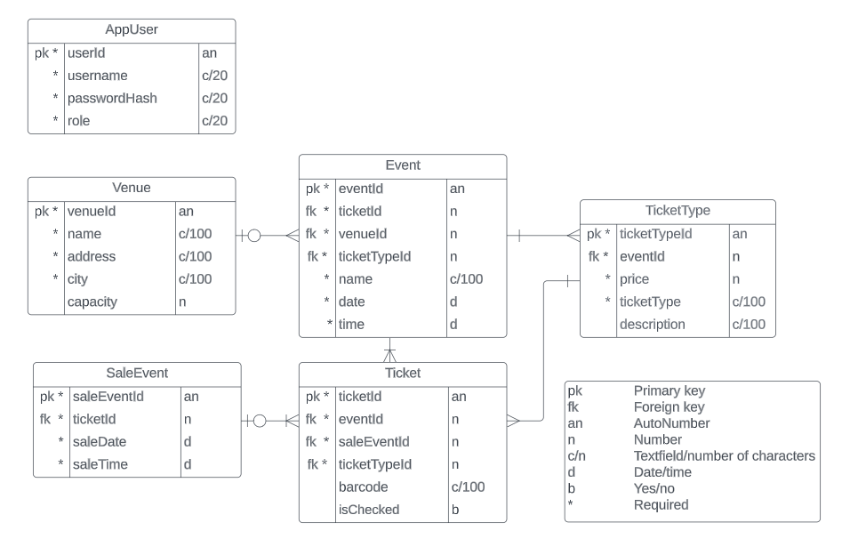

# TicketGuru

Team: KKVVR Solutions - Salla Komppa, Katariina Kuismin, Perttu Virkki, Joona Virolainen & Jenna Räihä

## Introduction

The client of the project is a ticketing agency, for which our task is to create a ticketing system called TicketGuru, through which the agency can sell tickets at points of sale and define events necessary for ticketing. The task of the ticket office is to sell and print the customer's tickets and, after the pre-sale ends, print the remaining free tickets for sale at the door. All tickets can set a code that allows the ticket to be used.

The customer wants ticket sales to be effortless and a system from which ticket balances (sold/remaining) can be easily tracked. We implement the back-end software as a Spring Boot project, where we add functionality (CRUD) by, among other things, relying on the iron wires supplied by the customer. The database system is SQL. The purpose is to develop an entity that works on all terminals at the point of sale. The expansion of the online store for customer use is only a further development, so the software development related to the user interface, i.e. the front end part, is not a major part of our project.

## System definition

### User groups

* Event manager = Business manager
* Seller = Ticket office sales point employee
* Ticket inspector = A ticket inspector who works at events
* Customer = Consumer buying tickets from the ticket office

### User stories

* As an event manager, I want to create new events in the system so that their tickets can be sold.

* As an event manager, I want to be able to set their own prices for tickets for different age groups, so that we can offer fair prices to our customers in different life situations.

* As an event manager, I want to edit event information and ticket prices so that changes or discounts can be made.

* As an event manager, I want to view the sales report of a single event so that I can review the profitability of the event.

* As a transaction manager, I want to list all sales transactions with their information so that I can record the information for accounting purposes.

* As a seller, I want to see all the events that are on sale, so that I can sell tickets to the event that the customer wants.

* As a seller, I want to see unsold advance tickets so I can print them to sell at the door.

* As a seller, I want sales transactions to have their own identifier, so that the investigation of error situations becomes easier.

* As a ticket inspector, I want the tickets to have their own identification codes so that checking them at the door is easier.

## User interface

### The initial user interface of the system

1. Ticket sale

2. Events

3. Sales history 

## Database

The tables of the database with their data are described in the diagram below. The chart also includes explanations of the types of data fields in the tables.

**Below are more detailed descriptions of each board.**

 #### AppUser
 The content of the AppUser table is the information of the system user.

 | Field        | Type         | Description                  |
 | ------------ | -----------  | ---------------------------- |
 | userId       | Long PK      | User id, not null       |
 | username     | varchar(20)  | User name, not null     |
 | passwordHash | varchar(20)  | User password, not null |
 | role         | varchar(20)  | User role, not null    |

 ---

 #### Event
 The content of the Event table is the event information.

 | Field        | Type         | Description                                                             |
 | ------------ | -----------  | ----------------------------------------------------------------------- |
 | eventId      | Long PK      | Event id, not null                                                      |
 | ticketId     | Long FK      | Event ticket, refers to Ticket-table, not null                          |
 | venueId      | Long FK	     | Event venue, refers to Venue-table, not null                            |
 | ticketTypeId | Long FK      | Type of ticket sold for the event, refers to TicketType-table, not null |
 | name         | varchar(100) | Event name, not null                                                    |
 | date         | dateTime     | Event date, not null                                                    |
 | time         | dateTime     | Event time, not null                                                    |

 ---

 #### Ticket
 The content of the Ticket board is the information of the ticket sold for the event. One ticket is valid for one event only. There can be many tickets for the event.

 | Field        | Type        | Description                                                        |
 | ------------ | ----------- | ------------------------------------------------------------------ |
 | ticketId     | Long PK     | Ticket id, not null                                                |
 | eventId      | Long FK     | Event id, for which the ticket is, refers to Event-table, not null |
 | saleEventId  | Long FK     | Sales transaction id, refers to SaleEvent-table, not null          |
 | ticketTypeId | Long FK     | Ticket type, refers to TicketType-table, not null                  |
 | barcode      | varchar(15) | The ticket's unique barcode                                        |
 | isChecked    | boolean     | Scanning the barcode of the ticket                                 |
 
 ---

 #### TicketType
 The contents of the TicketType table are the ticket types. Only one ticket type can be selected for a ticket.

 | Field        | Type         | Description                                                             |
 | ------------ | ------------ | ----------------------------------------------------------------------- |
 | ticketTypeId | Long PK      | Ticket type id, not null                                                |
 | eventId      | Long FK      | Event id, for which the ticket type is, refers to Event-table, not null |
 | price        | int          | Price of the ticket type, not null                                      |
 | ticketType   | varchar(100) | Customer type, not null                                                 |
 | description  | varchar(100) | Description of the ticket type                                          |

 ---

 #### Venue
 The content of the Venue board is the venue information. The event can only take place at one venue. There can be many events in one venue.

 | Field    | Type         | Description                          |
 | -------- | ------------ | ------------------------------------ |
 | venueId  | Long PK      | Venue id, not null                   |
 | name     | varchar(100) | Venue name, not null                 |
 | address  | varchar(100) | Street address of a venue, not null  |
 | city     | varchar(100) | City of a venue, not null            |
 | capacity | int          | Venue capacity                       |

 ---

 #### SaleEvent
 The content of the SaleEvent table is the sales event information. Several tickets can be connected to a sales event. One ticket can only be in one sales event.

 | Field       | Type     | Description                                          |
 | ----------- | -------- | ---------------------------------------------------- |
 | saleEventId | Long PK  | SaleEvent id, not null                               |
 | ticketId    | Long FK  | Ticket of an event, refers to Ticket-table, not null |
 | saleDate    | dateTime | Date of a sales transaction, not null                |
 | saleTime    | dateTime | Time of a sales transaction, not null                |

## API-documentation
[Link to API-documentation](https://github.com/kkuismin/kkvvrsolutions-ticketguru/tree/develop/TicketGuru/API%20Doc)

## Client
[Link to Client's code](https://github.com/Isanaiya/tg-client/tree/main)

## Test documentation
[Link to test documentation](https://github.com/kkuismin/kkvvrsolutions-ticketguru/blob/develop/TicketGuru/TicketGuruTestDocumentation.md)
